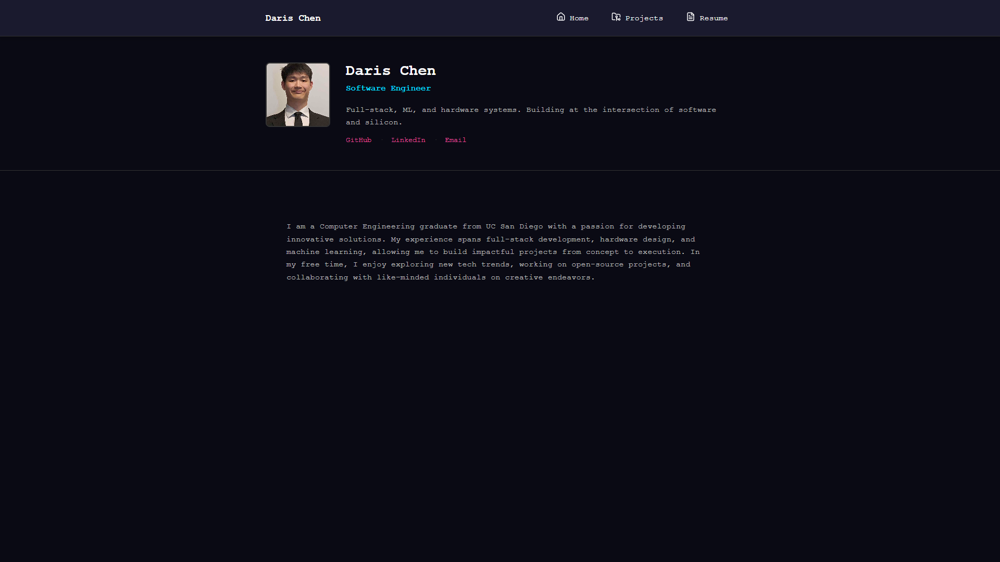
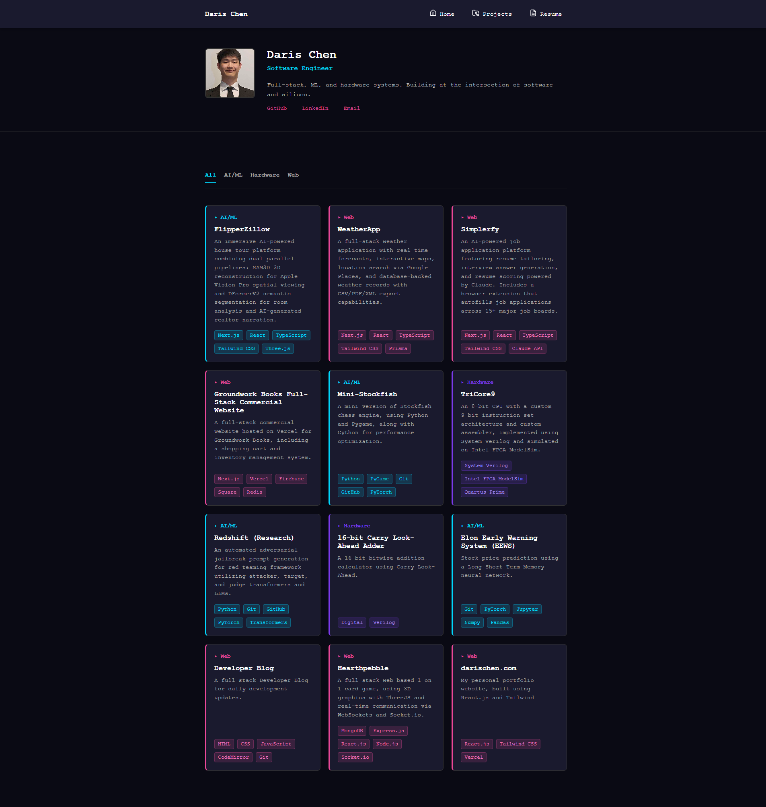
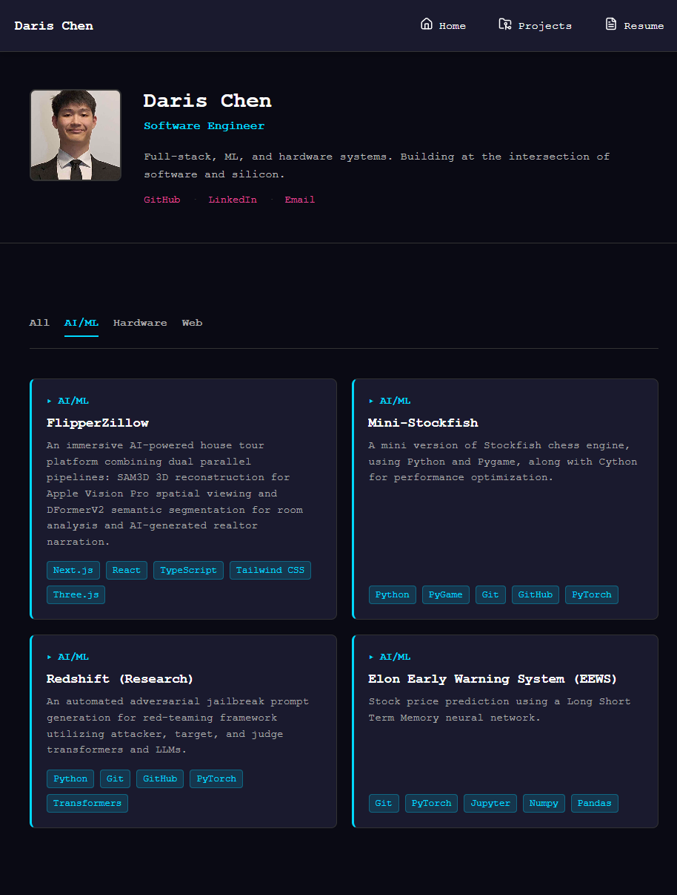
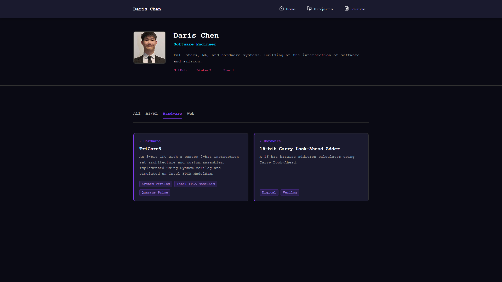
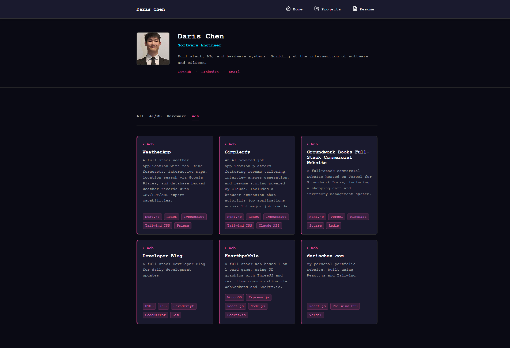
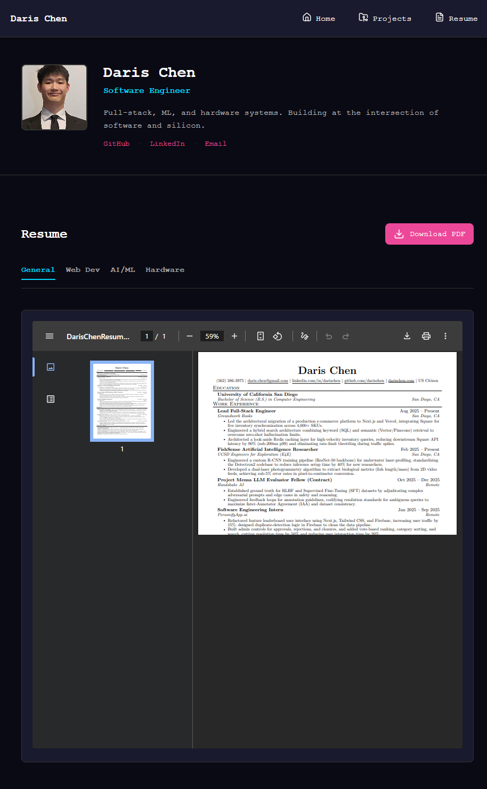
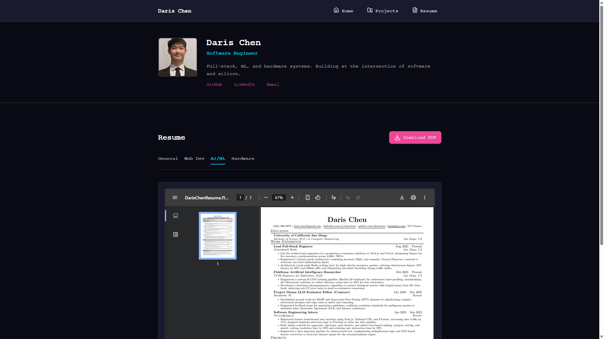
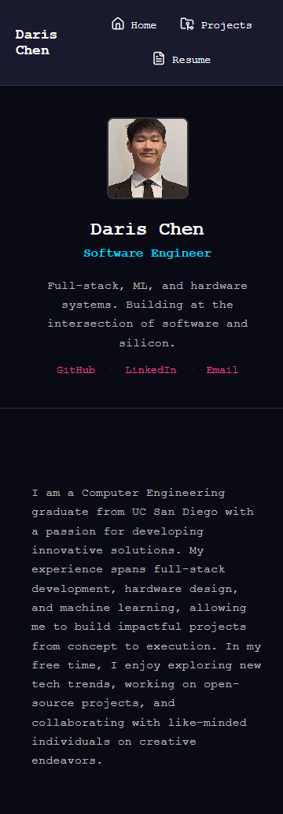
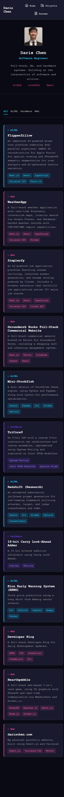

## Overview

A comprehensive redesign of the personal portfolio site to establish technical credibility across three distinct domains: AI/ML, hardware/low-level systems, and full-stack web development. The redesign introduces a sophisticated dark refined aesthetic with monospace typography throughout, a multi-accent color system for visual organization, and clear information hierarchy—all while maintaining clean, minimal design principles.

---

## Design Goals

- **Technical Credibility:** Position as a versatile mid-tier software engineer across diverse domains
- **Dark Refined Aesthetic:** Monospace-forward design with strategic color-coding and sophisticated restraint
- **Information Hierarchy:** Clear visual organization with consistent spacing, typography, and color usage
- **Responsive Design:** Mobile-first approach with graceful scaling across device sizes
- **Multi-Category Support:** Projects appear in multiple category tabs based on their domains

---

## Key Features

- **Medium Intro Header**
  - Headshot + name + title + bio in horizontal flex layout
  - Social links (GitHub, LinkedIn, Email) in hot pink accent color
  - Responsive stacking on mobile devices

- **Tab-Based Project Filtering**
  - All, AI/ML, Hardware, and Web tabs with category-specific accent colors
  - Dynamic filtering shows projects in multiple tabs based on assigned categories
  - Active tab underline matches category accent color

- **Color-Coded Project Grid**
  - Responsive grid with auto-fit columns (min 280px)
  - Category labels on each card with matching accent colors
  - Left border uses primary category color (cyan, violet, or hot pink)
  - Tech stack tags with semi-transparent backgrounds and bright text

- **Multi-Resume Support**
  - Four resume versions: General SWE, Web Dev, AI/ML, Hardware
  - Tab-based switching with dynamic PDF iframe
  - Download button updates based on active tab

- **Monospace Typography**
  - Courier New as primary font throughout
  - Consistent font sizing hierarchy
  - Bold weight for headings and labels

---

## Color Palette

| Category | Color | Use |
|----------|-------|-----|
| AI/ML | `#00d9ff` (Cyan) | Project titles, labels, tech tags |
| Hardware | `#7c3aed` (Violet) | Architecture, circuits, systems |
| Web | `#ec4899` (Hot Pink) | Full-stack, web applications |
| Background | `#0a0a14` (Deep Dark) | Primary background |
| Cards | `#1a1a2e` (Lighter Dark) | Card/panel backgrounds |
| Text Primary | `#ffffff` (White) | Headings and primary text |
| Text Secondary | `#e0e0e0` (Light Gray) | Descriptions and secondary text |

---

## Images

### Home Page

### Projects Page - All Tab

### Projects Page - AI/ML Tab

### Projects Page - Hardware Tab

### Projects Page - Web Tab

### Resume Page - General

### Resume Page - Tabs

### Resume Page - AI/ML Tab

### Home Page - Mobile

### Projects Page - Mobile

---

## Technical Implementation

**Frontend Stack:**
- React 18
- React Router for navigation
- CSS3 with custom properties (CSS variables)
- Responsive design with mobile breakpoint at 768px
- React Markdown for project detail pages

**Key Components:**
- PageHeader: Reusable header with headshot, name, title, bio, and social links
- TabNavigation: Flexible tab component with accent color variants
- ProjectCard: Project display with multi-category support and tech stack tags
- Projects: Tabbed project grid with filtering logic
- Resume: Multi-resume viewer with dynamic tab switching

**Styling Approach:**
- CSS custom properties for centralized theme management
- Flexbox and CSS Grid for layout
- No external CSS framework (pure CSS3)
- Mobile-first responsive design

---

## Success Metrics

✓ Monospace typography throughout
✓ Dark refined aesthetic with strategic accent colors
✓ Clear information hierarchy and visual organization
✓ Multi-category project support with dual-color display
✓ Responsive design scaling to mobile (768px breakpoint)
✓ Tab-based filtering for project and resume categories
✓ Professional presentation across all domains

